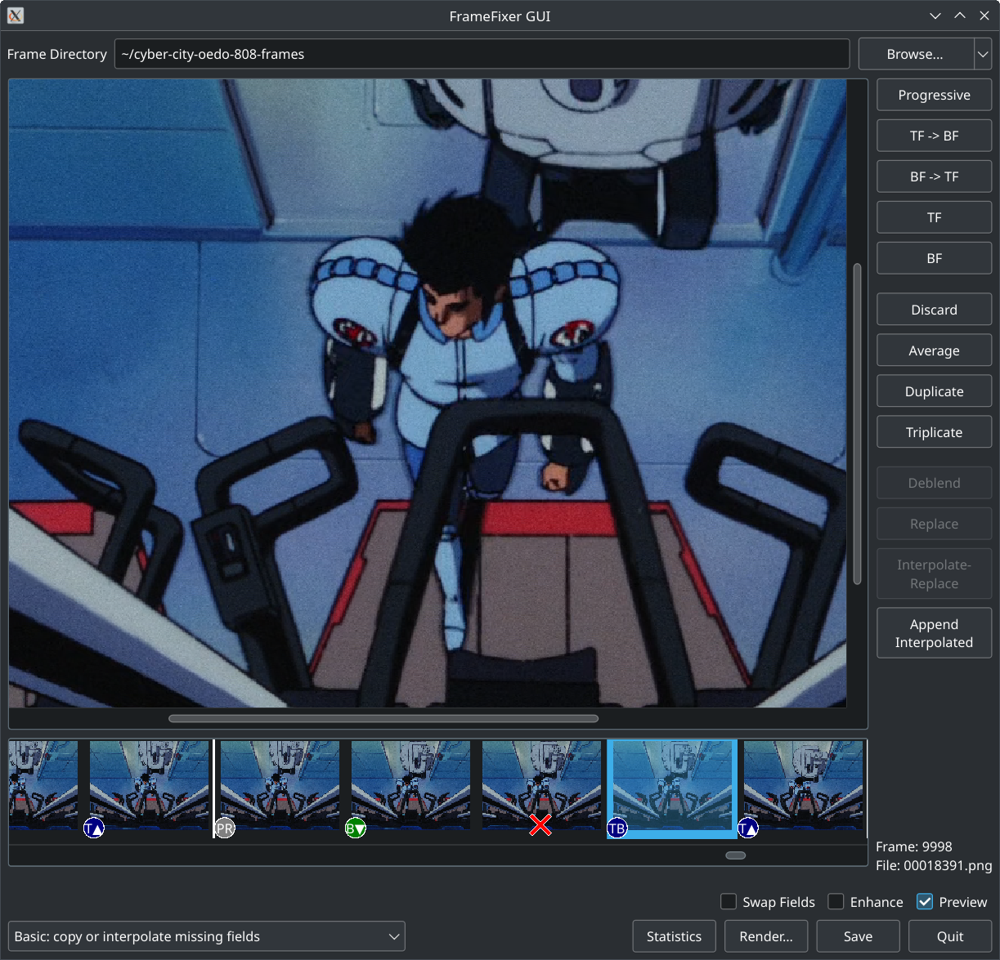

Frame Fixer
===========

This is a small program born out of my frustrations removing interlacing artifacts
from movies with a 3:2 pulldown (telecine). Said movies mixed up their telecine pattern with
every scene change, the upper third of frames lagged one frame behind (as if they were filmed
off a progressive source) and some other surprises QTGMC couldn't get on top of.

The Frame Fixer is specifically designed to do human-guided detelecining. As such, it is
a tool of last resort and fixing a whole movie this way is a crazy amount of work. To make it
as easy as possible, the tool's main workflow can entirely be controlled with the keyboard,
you get a big preview display that doesn't reset its zoom when switching between frames and
the workflow is non-destructive, i.e. you only *tag* what should be done with the frames,
but processing only happens when you click the "Render" button and select a target directory.

Because I wanted to keep complexity low, it works on a folder of PNG files. A 90 minute
movie, stored as 48 bit PNG files (16 bit color channels) in standard NTSC resolution
takes up about 100 GiB of disk space.

What is Telecine?
-----------------

Telecine is a way to turn 24 FPS movies into 30 FPS movies from the pre-computer era.
Instead of just displaying every 4. frame twice (1, 2, 3, 4, 4 ... 5, 6, 7, 8, 8 ...),
it uses interlacing to create two mixed images:

    Frame 1 (full)
    Frame 2 (full)
    Frame 2 (odd lines) + Frame 3 (even lines)
    Frame 3 (odd lines) + Frame 4 (even lines)
    Frame 4 (full)

This may or may not have appeared more smoothly on an interlaced NTSC television set.
Unfortunately, NTSC and telecine were still alive and well at the dawn of the DVD era,
so all DVD players must support interlacing and it is widely used.

What about VapourSynth?
-----------------------

My first attempt was to just use VapourSynth with QTGMC and vivtc. VapourSynth lets
you set up a frame processing pipeline for a movie in Python and p

QTGMC is considered the best deinterlacing filter and it digs really deep:
comb detection, motion vectors, frame averaging, artifact fixing, resharpening and more.

https://github.com/HomeOfVapourSynthEvolution/havsfunc/blob/f11d79c98589c9dcb5b10beec35b631db68b495c/havsfunc/havsfunc.py#L1912

And vivtc specifically handles telecine. As far as I understand it, its VFM  tries to
keep on top of the telecine rhythm and can pull deinterlaced frames from QTGMC as needed.

https://github.com/vapoursynth/vivtc/blob/master/docs/vivtc.rst

The result is still 30 FPS, so as the last step, its VDecimate would be used to delete one
in every 5 frames. Unfortunately, it deletes the frame with the least change, which means
that anywhere VFM and/or QTGMC get it wrong, the ugly mess of two mixed interlaced frames
looks like a large change and is amongst the frames that remain. This happens particularly
often with anime, where many frames are duplicates (and supposed to be) because the artists
animated at 9, 12 or 15 FPS.

What can it do?
---------------

The most important part: you can visually inspect frames and toggle between different
deinterlace modes, using either both fields, only the top or bottom field or doing proper
deinterlacing by filling the missing lines from the previous field.

In order to do a 29.98 fps to 23.976 fps conversion, where you'd delete every 5th frame,
you can tag frames as "discard." There are rhythm lines that help you see when you should
pick a frame to discard. Pressing "space" will also tell you how many frames you ought
to have emitted up to the cursor position and how many would actually get emitted.

For anime scenes where there are a lot of duplicate frames (they often update their
animation at 9 fps, 12 fps or 15 fps), you can also average between identical-looking frames,
or duplicate frames if you have bad and good versions of the same frame. You can even replace
frames entirely with frames from somewhere else in the movie.

Finally, frame fixer can selectively invoke external AI interpolation tools such as RIFE.
If a frame is beyond repair and there's no good replacement, perhaps you can let an AI
synthesize a replacement that looks better than whar you have. You could also use this to
smooth out individual scenes if the animation suddenly goes into 6 fps territory.
